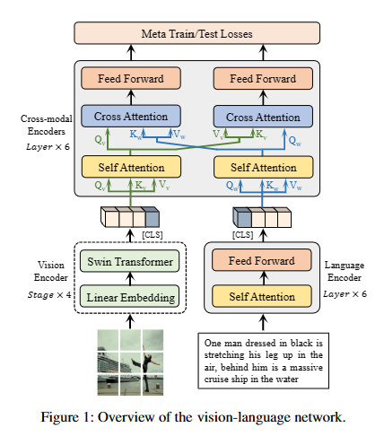

# CoVLR

## Approach

### This is the overall framework of our method




### Abstract
Vision-language retrieval aims to perform cross-modal instances search by learning consistent vision-language representations. However, in real applications, vision-language divergence always results in strong and weak modalities and different modalities have various performances in uni-modal tasks. In this paper, we reveal that traditional vision-language hard consistency disrupts the relationships among uni-modal instances considering the weak-strong modal scenario, causing a decline in uni-modal retrieval capability. To address this issue, we propose Coordinated Vision-Language Retrieval (CoVLR), a solution that cooperatively optimizes both cross-modal consistency and intra-modal structure-preserving objectives via a meta-learning strategy. Specifically, CoVLR utilizes intra-modal structure-preserving as the meta-test task to validate the cross-modal consistency loss, which is considered the meta-train task. The effectiveness of CoVLR is validated through extensive experiments on commonly used datasets, which demonstrate superior results compared to other baselines on various retrieval scenarios.

## Prerequisites
- Python 3
- PyTorch
- Transformers
- NumPy
- YAML

## Installation
1. Clone this repository:
   ```bash
   git clone <repository_url>
   ```
2. Install dependencies:
   ```bash
   pip install -r requirements.txt
   ```

## Usage
1. Prepare your dataset and update the configuration file accordingly.
2. Run training:
   ```bash
   python train.py --config <path_to_config_file> --output_dir <output_directory>
   ```
3. Run evaluation:
   ```bash
   python train.py --config <path_to_config_file> --output_dir <output_directory> --checkpoint <path_to_checkpoint> --evaluate
   ```

## Configuration
- You need to provide a YAML configuration file specifying various parameters such as batch size, learning rate, model architecture, etc. An example configuration file (`configs/Retrieval_flickr.yaml`) is provided in this repository.

## Arguments
- `--checkpoint`: Path to the checkpoint file for resuming training or performing evaluation.
- `--config`: Path to the YAML configuration file.
- `--output_dir`: Directory where output files including logs, checkpoints, and results will be saved.
- `--device`: Device to run the code (`cuda` for GPU or `cpu` for CPU).
- `--seed`: Random seed for reproducibility.
- `--bs`: Batch size per GPU.
- `--evaluate`: Flag to perform evaluation only without training.

## Citation
If you find this code useful in your research, please consider citing:

```
Fengqiang Wan, Xiangyu Wu, Zhihao Guan, Yang Yang*. CoVLR: Coordinating Cross-Modal Consistency and Intra-Modal Relations for Vision-Language Retrieval. IEEE International Conference on Multimedia and Expo (ICME-2024), Niagara Falls, Canada, 2024. (CCF-B)

```
